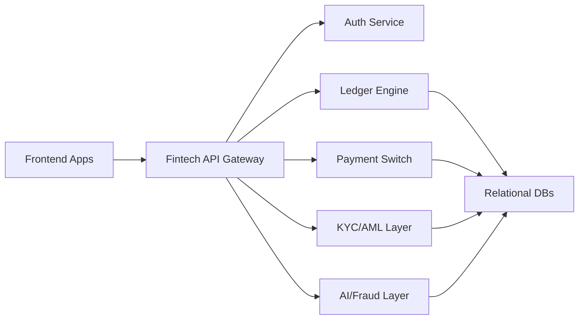

# 💸 High-Level Fintech Products – Research Lab

## 🚀 Exploring the Future of Fintech Infrastructure & Experiences

This repository is a curated collection of **system design blueprints**, **emerging product ideas**, and **technical research** on scalable, modular, and regulation-aware **fintech solutions**. It’s built for founders, engineers, and product minds working at the intersection of **finance**, **technology**, and **human-centered design**.

---

## 🔍 Research Objectives

| Focus Area | Description |
|------------|-------------|
| 💰 Core Banking Systems | Modular APIs, virtual ledger models, multi-wallet support |
| 📲 Financial UX | Personal finance interfaces, credit flows, and inclusive onboarding |
| 🛡 Compliance Engineering | KYC/AML orchestration, auditability, and trust-by-design |
| 📈 Data & Risk Intelligence | Real-time analytics, risk scoring, fraud detection pipelines |
| 🌍 Fintech for Underserved | Open finance in emerging markets, offline-capable tools |

---

## 🧠 Featured Research Projects

### 1. **Composable Ledger Engine**
> A flexible virtual ledger system for wallets, payments, and transactional flows.

- 🧾 Multi-wallet architecture (sub-accounts, holds, escrow)
- 🏦 Double-entry support with journal-based reconciliation
- 🔌 RESTful API design for extensibility

**📄 Design Doc:** `/core-banking/ledger-engine.md`  
**📐 System Diagram:** `/core-banking/ledger-arch.drawio`  
**Stack:** PostgreSQL, TypeORM, FastAPI, Kafka

---

### 2. **Unified KYC/AML Orchestration Layer**
> Plug-and-play compliance workflow builder for regulated fintech products.

- 🧩 Adapter-based integrations (ID verification, sanctions, biometrics)
- 🔁 Rule engine for local/global compliance
- 📜 Audit trail and versioned decision logs

**📄 System Design:** `/compliance/kyc-orchestrator.md`  
**📊 Flowcharts:** `/compliance/workflow-engine.drawio`  
**Stack:** Node.js, Temporal.io, MongoDB

---

### 3. **Open Microfinance Platform**
> Infrastructure for building lending apps, SACCOs, and digital cooperatives.

- 📆 Loan product configurator (interest models, repayment cycles)
- 📈 Credit scoring with alternative data (telco, mobile money)
- 📱 Offline-first progressive web app

**📄 Design Blueprint:** `/microfinance/platform-design.md`  
**📐 Architecture:** `/microfinance/system-overview.drawio`  
**Stack:** Django, GraphQL, SQLite Sync, React Native

---

### 4. **Smart Payment Routing Engine**
> Real-time payment switching layer for multi-rail support (cards, mobile, crypto).

- 🔀 Dynamic fee and fallback routing
- 💸 Multi-rail logic for domestic/international
- 🔐 PCI/DSS-aware tokenized storage

**📄 Tech Design:** `/payments/routing-engine.md`  
**📊 Architecture Map:** `/payments/payment-switch.drawio`  
**Stack:** Go, Redis, gRPC, Stripe SDKs

---

### 5. **AI in Fintech Ops**
> Enhancing support, fraud detection, and analytics with ML/LLMs.

- 🤖 LLM-powered customer support copilot
- 🔍 Fraud pattern classification models
- 📊 Forecasting tools for liquidity & loan risk

**📄 Research Notes:** `/ai-fintech/use-cases.md`  
**🖼️ UI Mockups:** `/ai-fintech/agent-ui.fig`  
**Stack:** Python, LangChain, GPT-4, Scikit-learn

---

## 🧱 System Architecture Overview



---

## 🛠 Tools & Platforms

| Category | Stack |
|----------|-------|
| Backend  | FastAPI, Django, Node.js, Go |
| Infra    | PostgreSQL, Redis, Kafka, Temporal |
| Frontend | Next.js, React Native, Tailwind |
| AI/ML    | LangChain, GPT-4, Scikit-learn |
| Payments | Stripe, Flutterwave, Paystack |
| Compliance | SmileID, Onfido, Alloy |

---

## 📁 Directory Structure

```
/core-banking
  └── ledger-engine.md
  └── ledger-arch.drawio

/compliance
  └── kyc-orchestrator.md
  └── workflow-engine.drawio

/microfinance
  └── platform-design.md
  └── system-overview.drawio

/payments
  └── routing-engine.md
  └── payment-switch.drawio

/ai-fintech
  └── use-cases.md
  └── agent-ui.fig
```

---

## 🌍 Exploring New Frontiers

Future research topics:

- 🔐 Account abstraction in fintech
- 🌐 CBDCs and programmable payments
- 🧾 Fintech SaaS: White-label banking kits
- 📱 Chat-first fintech with AI agents
- 🌎 Embedded finance in education, health, agriculture

---

## ✨ Mission

To architect **inclusive, scalable, and resilient** financial tools for the next generation of users—especially in underserved and fast-growing markets.

---

## 📬 Let’s Collaborate

Have a fintech idea, partnership, or just want to jam on future finance tools? Let’s chat.

📧 **Email:** [brandon@techopsapex.com](mailto:brandon@techopsapex.com)  
🌐 **LinkedIn:** [linkedin.com/in/brandon-opere-14b5a5203](https://linkedin.com/in/brandon-opere-14b5a5203)  
🐙 **GitHub:** [github.com/teambits009](https://github.com/teambits009)

---

> _“Fintech is no longer just a product — it's an infrastructure for equity, speed, and economic growth.”_

--- 

Let me know if you want it broken down into separate MD files per research project, or rendered with visuals like Mermaid diagrams and badges on GitHub.
